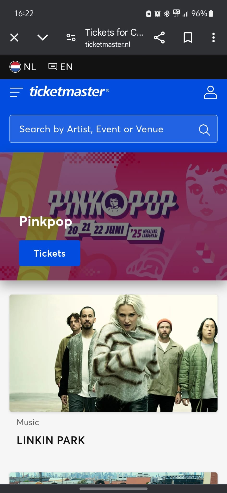

# Procesverslag
Markdown is een simpele manier om HTML te schrijven.  
Markdown cheat cheet: [Hulp bij het schrijven van Markdown](https://github.com/adam-p/markdown-here/wiki/Markdown-Cheatsheet).

Nb. De standaardstructuur en de spartaanse opmaak van de README.md zijn helemaal prima. Het gaat om de inhoud van je procesverslag. Besteedt de tijd voor pracht en praal aan je website.

Nb. Door *open* toe te voegen aan een *details* element kun je deze standaard open zetten. Fijn om dat steeds voor de relevante stuk(ken) te doen.

## Jij

  
uitwerken voor kick-off werkgroep

  ### Auteur:
  Lauren Cheung

  #### Je startniveau:
  blauw

  #### Je focus:
  responsive
 

## Je website

  
uitwerken voor kick-off werkgroep

  ### Je opdracht:
  https://www.ticketmaster.nl/

  #### Screenshot(s) van de eerste pagina (small screen): 
  Hoofdpagina  
  

  #### Screenshot(s) van de tweede pagina (small screen):
  Detailpagina  
  
  

## Toegankelijkheidstest 1/2 (week 1)

  
uitwerken na test in 2e werkgroep

 Oefening Toegankelijkheidstesten

  Mobiliteit:
  Om de mobiliteit te testen heb ik elastiekjes om mijn vingers gedaan en geprobeerd de Ticketmaster-website te gebruiken. Dit verliep zonder grote problemen; de website bleef goed bruikbaar. De enige uitdaging  was dat de elastiekjes oncomfortabel aanvoelden, maar dit had geen invloed op de werking van de site.

  Zichtbaarheid:
  Voor het testen van zichtbaarheid heb ik verschillende brillen gedragen, waaronder brillen met wazige plekken of vlekken. Hierdoor waren sommige delen van de website lastig direct te zien. Door te scrollen    werd de inhoud echter geleidelijk zichtbaar, en het lezen van de content was goed te doen. Hoewel het moeilijk is om alles in één oogopslag te overzien, blijft de leesbaarheid van de site voldoende.

  Motoriek:
  Met behulp van een elektrische spierstimulator heb ik gesimuleerd hoe het is om controle over bepaalde bewegingen en gevoel in de arm of hand te verliezen, vergelijkbaar met de ervaringen van mensen met     bijvoorbeeld Parkinson. Dit maakte het gebruik van de website uitdagender, vooral bij het typen in de zoekbalk of het navigeren met de muis. Toch viel op dat de website voldoende ruimte biedt tussen de   verschillende elementen, waardoor ik niet per ongeluk op het verkeerde klikte. Dit zorgde voor een prettige ervaring ondanks de motorische beperkingen.
  
  ### Screenreader test
  Gebruik van de screenreader op de website Ticketmaster.nl

  Screenreader activeren:
  Windows-toets + Ctrl + Enter

  Bij het testen van de screenreader op de Ticketmaster-website viel het volgende op: bij activatie begint de screenreader automatisch in hoog tempo door de website te navigeren, wat overweldigend kan zijn. Door gebruik te maken van de pijltjestoetsen is het mogelijk om handmatig door de inhoud te gaan en zelf te bepalen wanneer naar de volgende sectie wordt genavigeerd. De screenreader volgt een vaste volgorde: van boven naar beneden en van links naar rechts. Een aandachtspunt is dat het moeilijk is om snel specifieke informatie te vinden, omdat de inhoud chronologisch moet worden doorlopen.

  ### A11Y test
Samen met Elif hebben we onze websites beoordeeld en een A11Y-test uitgevoerd om te controleren of ze voldoen aan de toegankelijkheidseisen. Tijdens de test kwamen we enkele aandachtspunten tegen op de huidige versie van de Ticketmaster-app die niet aan de normen voldoen. Deze punten zal ik meenemen bij het herontwerpen en reproduceren van de website.

## Breakdownschets (week 1)

  
uitwerken na afloop 3e werkgroep

  ### de hele pagina: 
  

## Voortgang 1 (week 2)

  
uitwerken voor 1e voortgang

  ### Stand van zaken
  hier dit ging goed & dit was lastig (neem ook screenshots op van delen van je website en code)

  ### Agenda voor meeting
  samen met je groepje opstellen

  | student 1      | student 2          | student 3    | student 4        |
  | ---            | ---                | ---          | ---              |
  | dit bespreken  | en dit             | en ik dit    | en dan ik dat    |
  | en dat ook nog | dit als er tijd is | nog een punt | dit wil ik zeker |
  | ...            | ...                | ...          | ...              |

  ### Verslag van meeting
  hier na afloop snel de uitkomsten van de meeting vastleggen

  - punt 1
  - punt 2
  - nog een punt
  - ...

## Voortgang 2 (week 3)

  
uitwerken voor 2e voortgang

  ### Stand van zaken
  hier dit ging goed & dit was lastig (neem ook screenshots op van delen van je website en code)

  ### Agenda voor meeting
  samen met je groepje opstellen

  | student 1      | student 2          | student 3    | student 4        |
  | ---            | ---                | ---          | ---              |
  | dit bespreken  | en dit             | en ik dit    | en dan ik dat    |
  | en dat ook nog | dit als er tijd is | nog een punt | dit wil ik zeker |
  | ...            | ...                | ...          | ...              |

  ### Verslag van meeting
  hier na afloop snel de uitkomsten van de meeting vastleggen

  - punt 1
  - punt 2
  - nog een punt
- ...

## Toegankelijkheidstest 2/2 (week 4)

  
uitwerken na test in 9e werkgroep

  ### Bevindingen
  Lijst met je bevindingen die in de test naar voren kwamen (geef ook aan wat er verbeterd is):

## Voortgang 3 (week 4)

  
uitwerken voor 3e voortgang

  ### Stand van zaken
  hier dit ging goed & dit was lastig (neem ook screenshots op van delen van je website en code)

  ### Agenda voor meeting
  samen met je groepje opstellen

  | student 1      | student 2          | student 3    | student 4        |
  | ---            | ---                | ---          | ---              |
  | dit bespreken  | en dit             | en ik dit    | en dan ik dat    |
  | en dat ook nog | dit als er tijd is | nog een punt | dit wil ik zeker |
  | ...            | ...                | ...          | ...              |

  ### Verslag van meeting
  hier na afloop snel de uitkomsten van de meeting vastleggen

  - punt 1
  - punt 2
  - nog een punt
  - ...

## Eindgesprek (week 5)

  
uitwerken voor eindgesprek

  ### Je uitkomst - karakteristiek screenshots:
  

  ### Dit ging goed/Heb ik geleerd: 
  Korte omschrijving met plaatjes

  

  ### Dit was lastig/Is niet gelukt:
  Korte omschrijving met plaatjes

  

## Bronnenlijst

  
continu bijhouden terwijl je werkt

  Nb. Wees specifiek ('css-tricks' als bron is bijv. niet specifiek genoeg). 
  Nb. ChatGpT en andere AI horen er ook bij.
  Nb. Vermeld de bronnen ook in je code.

  1. bron 1
  2. bron 2
  3. ...

